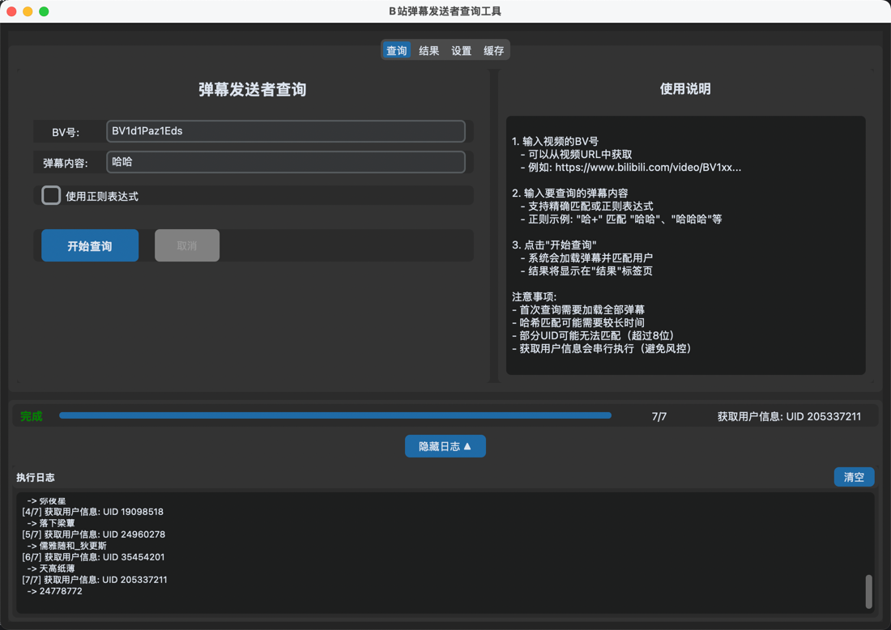
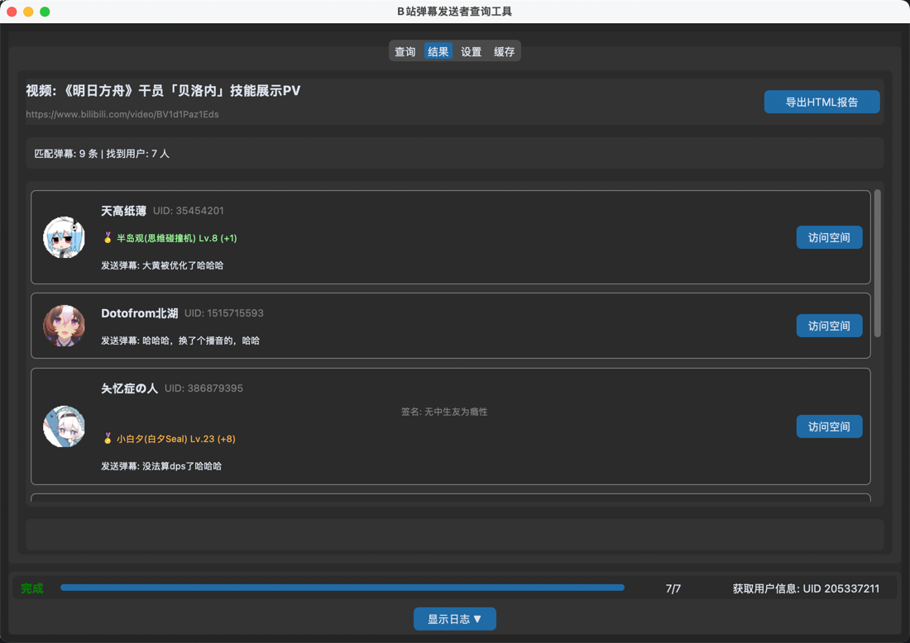
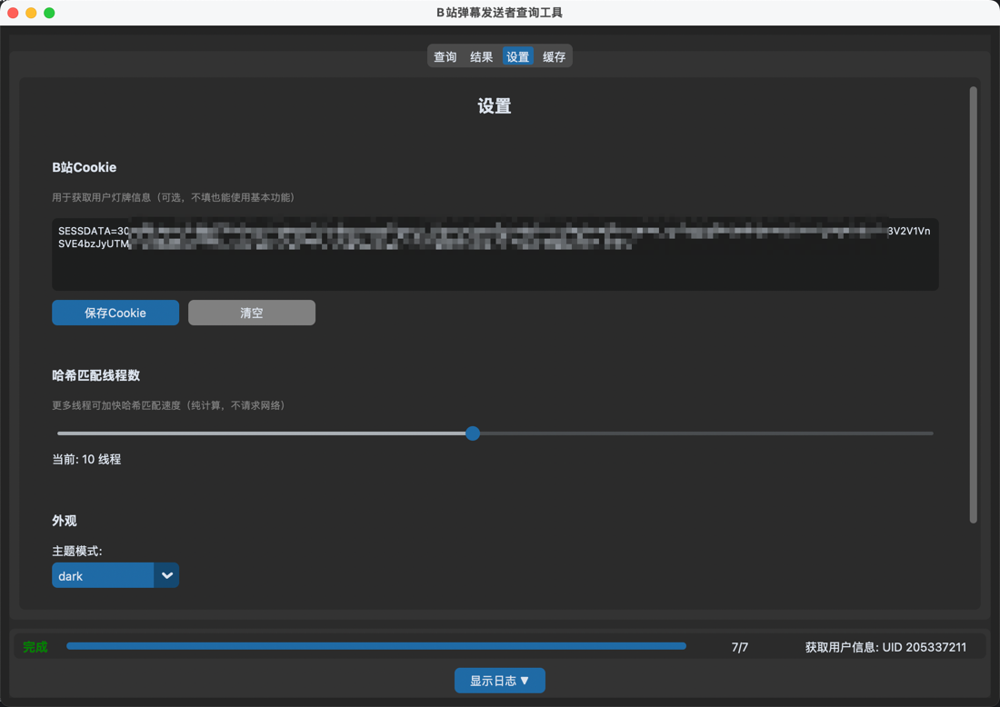
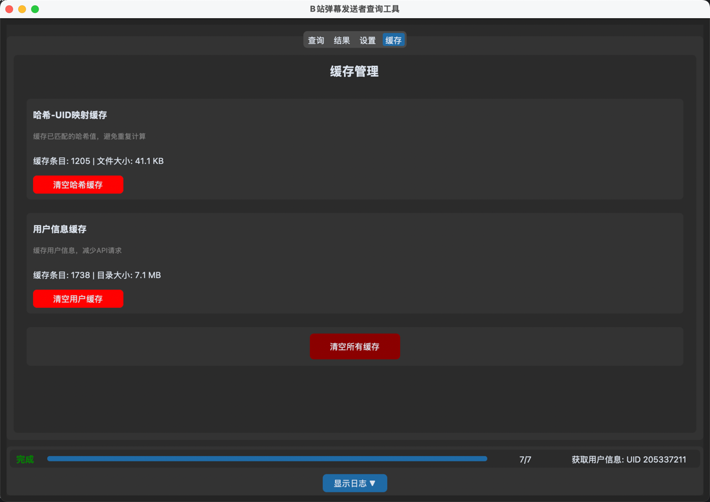

# Bilibili视频弹幕用户分析工具

基于Python实现，用于分析Bilibili视频的弹幕数据，提取用户信息弹幕内容。

## Feature 1.0 (Command Line Interface)

提取SESSDATA，保存到文件或直接在参数中使用即可


## Feature 2.0 (GUI)









## 目录结构

```
bilibili-danmaku-tracker/
├── src/                      # 源代码
│   ├── danmaku_tracker.py    # 核心逻辑（CLI版本）
│   └── gui/                  # GUI模块
│       ├── __init__.py
│       ├── app.py              # GUI应用入口
│       ├── main_window.py    # 主窗口
│       ├── views/              # 视图
│       │   ├── search_view.py
│       │   ├── results_view.py
│       │   ├── settings_view.py
│       │   └── cache_view.py
│       ├── components/         # 组件
│       │   ├── user_card.py
│       │   ├── progress_panel.py
│       │   └── log_viewer.py
│       ├── controllers/         # 控制器
│       │   └── tracker_controller.py
│       ├── models/            # 数据模型
│       │   └── app_state.py
│       └── utils/              # 工具类
│           ├── config_manager.py
│           └── threading.py
├── scripts/                # 脚本
│   └── ...
├── data/                     # 运行时数据
│   └── cache/                # 缓存目录
│       ├── hash_cache.json     # 嶈息缓存
│       └── userinfo/            # 用户信息缓存
├── output/                  # 输出
│   └── report/                # 生成的报告
├── config.json               # 配置文件
├── requirements.txt           # 依赖列表
├── run_gui.py               # GUI启动入口
└── README.md               # 说明文档
```

__注意：因crc32具有弱碰撞性，所以在匹配用户时可能会出现错误或匹配到错误的用户，准确率非100%，请自行判断真实性__

## Thanks

@qianjiachun https://github.com/qianjiachun/bilibili-danmaku-tracker 感谢作者的完整思路，本项目基于其代码进行Python适配

@Nemo2011 https://github.com/Nemo2011/bilibili-api 优质的Bilibili API库
@Aruelius https://github.com/Aruelius/crc32-crack B站用户id相关 CRC32 算法的Python实现
