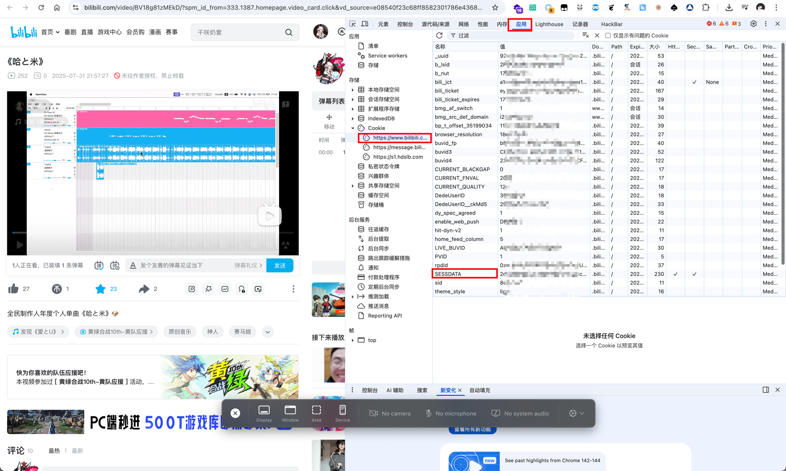
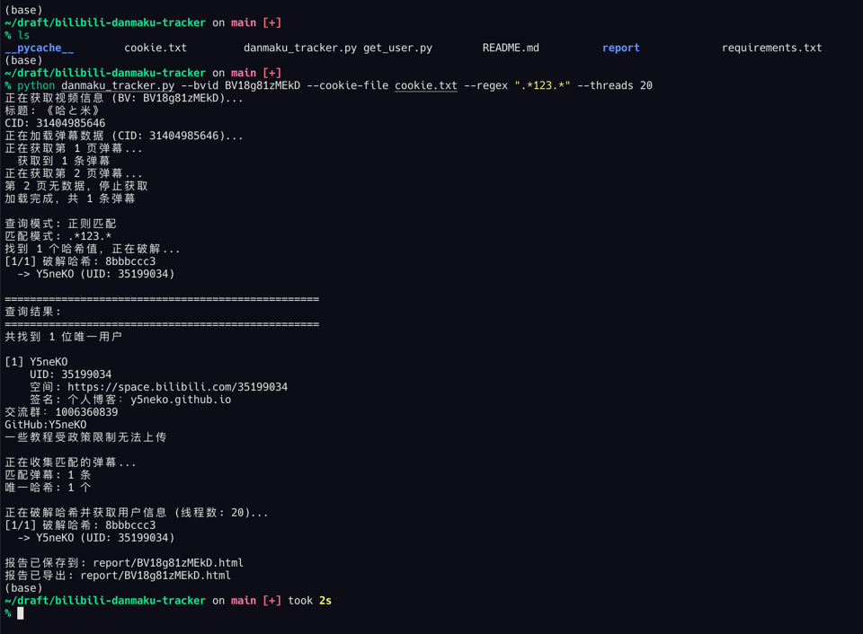
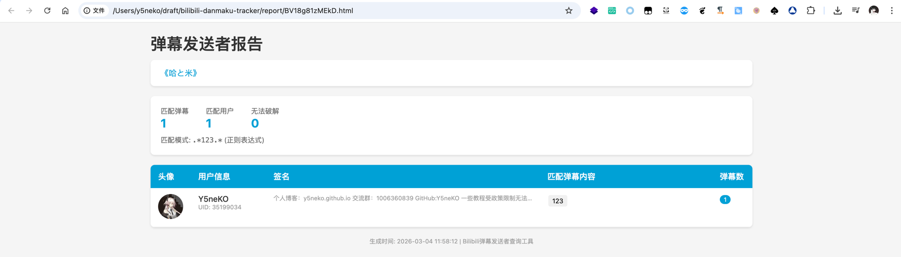

# README

Bilibili视频弹幕用户分析工具，基于Python实现，用于分析Bilibili视频的弹幕数据，提取用户信息和弹幕内容。

## Feature

提取SESSDATA，保存到文件或直接在参数中使用即可

## Thanks

@Nemo2011 https://github.com/Nemo2011/bilibili-api 优质的Bilibili API库

@Aruelius https://github.com/Aruelius/crc32-crack B站用户id相关 CRC32 算法的 Python 实现

@qianjiachun https://github.com/qianjiachun/bilibili-danmaku-tracker 感谢作者的完整思路，本项目基于其代码进行Python适配